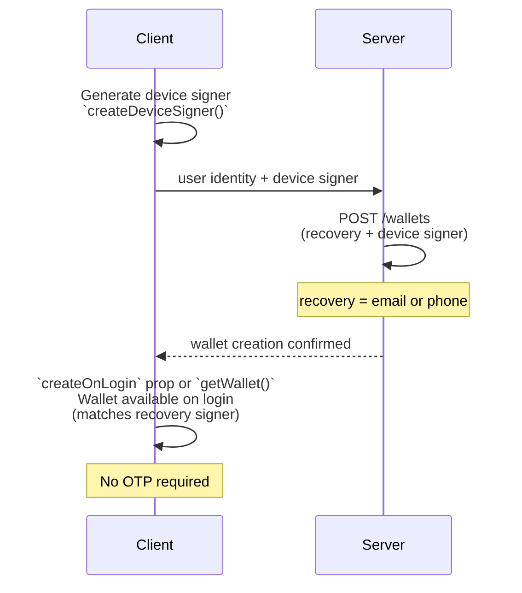

# Server-Side Wallet with Device Signer

> Build a seamless wallet experience where your server manages wallet creation and recovery while users sign transactions instantly on their device — no OTP required.

Most applications create wallets server-side for security and control. However, to enable frictionless client-side signing with a [device signer](/wallets/guides/signers/device-signer), it must be registered at wallet creation time — otherwise, adding it later requires an OTP verification step.

This guide walks through the recommended pattern: generate the device signer on the client, send it to your server, create the wallet with both the device signer and an email recovery signer, then return the wallet to the client.

## Prerequisites

* A **server API key** with `wallets.create` and `wallets.read` scopes
* A **client API key** for the React or React Native SDK
* `@crossmint/client-sdk-react-ui` installed on the client (React), or `@crossmint/client-sdk-react-native-ui` (React Native)

## Architecture



## Provider Setup

Wrap your app with the Crossmint providers. During the initial wallet creation flow, omit `createOnLogin` — the wallet will be created server-side in [Step 2](#step-2-create-the-wallet-server).

<Tabs>
  <Tab title="React">
    ```tsx theme={null}
    import {
        CrossmintProvider,
        CrossmintAuthProvider,
        CrossmintWalletProvider,
    } from "@crossmint/client-sdk-react-ui";

    function App({ children }) {
        return (
            <CrossmintProvider apiKey="YOUR_CLIENT_API_KEY">
                <CrossmintAuthProvider loginMethods={["email", "google"]}>
                    <CrossmintWalletProvider>
                        {children}
                    </CrossmintWalletProvider>
                </CrossmintAuthProvider>
            </CrossmintProvider>
        );
    }
    ```
  </Tab>

  <Tab title="React Native">
    ```tsx theme={null}
    import { useEffect } from "react";
    import {
        CrossmintProvider,
        CrossmintWalletProvider,
        useCrossmint,
    } from "@crossmint/client-sdk-react-native-ui";

    // Replace with your auth provider
    // See: https://docs.crossmint.com/wallets/guides/bring-your-own-auth
    import { YourAuthProvider, useYourAuth } from "@your-auth-provider";

    function App({ children }) {
        return (
            <YourAuthProvider>
                <CrossmintProvider apiKey="YOUR_CLIENT_API_KEY">
                    <CrossmintWalletProvider>
                        <JwtSync />
                        {children}
                    </CrossmintWalletProvider>
                </CrossmintProvider>
            </YourAuthProvider>
        );
    }

    function JwtSync() {
        const { jwt } = useYourAuth();
        const { setJwt } = useCrossmint();

        useEffect(() => {
            setJwt(jwt);
        }, [jwt]);

        return null;
    }
    ```
  </Tab>
</Tabs>

## Step 1: Create the Device Signer (Client)

Use `createDeviceSigner()` from the `useWallet` hook to generate a hardware-backed P256 keypair on the user's device. This happens **before** any wallet exists.

The returned descriptor contains the public key coordinates and a locator — it looks like this:

```json theme={null}
{
    "type": "device",
    "publicKey": { "x": "0x...", "y": "0x..." },
    "locator": "device:<base64-public-key>",
    "name": "Chrome on Mac"
}
```

<Tabs>
  <Tab title="React">
    ```tsx theme={null}
    import { useWallet } from "@crossmint/client-sdk-react-ui";
    import { useState } from "react";

    function CreateWalletFlow() {
        const { createDeviceSigner } = useWallet();
        const [walletAddress, setWalletAddress] = useState<string | null>(null);

        const handleCreateWallet = async () => {
            const deviceSigner = await createDeviceSigner();

            // Send the device signer to your server to create the wallet
            const response = await fetch("/api/wallet", {
                method: "POST",
                headers: { "Content-Type": "application/json" },
                body: JSON.stringify({
                    email: "user@example.com",
                    deviceSigner,
                }),
            });
            const { address } = await response.json();
            setWalletAddress(address);
        };

        return (
            <div>
                {walletAddress ? (
                    <p>Wallet: {walletAddress}</p>
                ) : (
                    <button onClick={handleCreateWallet}>Create Wallet</button>
                )}
            </div>
        );
    }
    ```

    <Note>
      The `createDeviceSigner()` function generates and stores the private key in the browser's secure storage (hidden iframe at `crossmint-signer.io`). The private key **never leaves the device** — only the public key descriptor is sent to the server.
    </Note>
  </Tab>

  <Tab title="React Native">
    ```tsx theme={null}
    import { useWallet } from "@crossmint/client-sdk-react-native-ui";
    import { useState } from "react";
    import { View, Text, TouchableOpacity } from "react-native";

    function CreateWalletFlow() {
        const { createDeviceSigner } = useWallet();
        const [walletAddress, setWalletAddress] = useState<string | null>(null);

        const handleCreateWallet = async () => {
            const deviceSigner = await createDeviceSigner();

            // Send the device signer to your server to create the wallet
            const response = await fetch("https://YOUR_SERVER/api/wallet", {
                method: "POST",
                headers: { "Content-Type": "application/json" },
                body: JSON.stringify({
                    email: "user@example.com",
                    deviceSigner,
                }),
            });
            const { address } = await response.json();
            setWalletAddress(address);
        };

        return (
            <View>
                {walletAddress ? (
                    <Text>Wallet: {walletAddress}</Text>
                ) : (
                    <TouchableOpacity onPress={handleCreateWallet}>
                        <Text>Create Wallet</Text>
                    </TouchableOpacity>
                )}
            </View>
        );
    }
    ```

    <Note>
      The `createDeviceSigner()` function generates and stores the private key in the device's native secure storage (iOS Secure Enclave / Android Keystore). The private key **never leaves the device** — only the public key descriptor is sent to the server.
    </Note>
  </Tab>
</Tabs>

## Step 2: Create the Wallet (Server)

On your server, use the device signer descriptor received from the client to create a wallet with email recovery and the device signer pre-registered.

<CodeGroup>
  ```typescript Node.js theme={null}
  import { createCrossmint, CrossmintWallets } from "@crossmint/wallets-sdk";

  const crossmint = createCrossmint({
      apiKey: "YOUR_SERVER_API_KEY",
  });

  const crossmintWallets = CrossmintWallets.from(crossmint);

  // deviceSigner is the object received from the client
  const wallet = await crossmintWallets.createWallet({
      chain: "base-sepolia",
      owner: "email:user@example.com",
      recovery: {
          type: "email",
          email: "user@example.com",
      },
      signers: [deviceSigner],
  });

  console.log("Wallet created:", wallet.address);
  // Return wallet.address to the client
  ```

  ```bash cURL theme={null}
  # Note: The REST API uses different field names than the SDK:
  #   - "adminSigner" instead of "recovery"
  #   - "delegatedSigners" instead of "signers"
  # Public key coordinates must be decimal strings (not hex).
  curl --request POST \
      --url 'https://staging.crossmint.com/api/2025-06-09/wallets' \
      --header 'X-API-KEY: YOUR_SERVER_API_KEY' \
      --header 'Content-Type: application/json' \
      --data '{
          "chainType": "evm",
          "type": "smart",
          "owner": "email:user@example.com",
          "config": {
              "adminSigner": {
                  "type": "email",
                  "email": "user@example.com"
              },
              "delegatedSigners": [
                  {
                      "signer": {
                          "type": "device",
                          "publicKey": {
                              "x": "DECIMAL_STRING_X_COORDINATE",
                              "y": "DECIMAL_STRING_Y_COORDINATE"
                          },
                          "name": "Chrome on Mac"
                      }
                  }
              ]
          }
      }'
  ```

  ```python Python theme={null}
  # Note: The REST API uses different field names than the SDK:
  #   - "adminSigner" instead of "recovery"
  #   - "delegatedSigners" instead of "signers"
  # Public key coordinates must be decimal strings (not hex).
  import requests

  url = "https://staging.crossmint.com/api/2025-06-09/wallets"

  payload = {
      "chainType": "evm",
      "type": "smart",
      "owner": "email:user@example.com",
      "config": {
          "adminSigner": {
              "type": "email",
              "email": "user@example.com"
          },
          "delegatedSigners": [
              {
                  "signer": {
                      "type": "device",
                      "publicKey": {
                          "x": "DECIMAL_STRING_X_COORDINATE",
                          "y": "DECIMAL_STRING_Y_COORDINATE"
                      },
                      "name": "Chrome on Mac"
                  }
              }
          ]
      }
  }
  headers = {
      "X-API-KEY": "YOUR_SERVER_API_KEY",
      "Content-Type": "application/json"
  }

  response = requests.post(url, json=payload, headers=headers)
  print(response.json())
  ```
</CodeGroup>

## Step 3: Use the Wallet (Client)

Once the wallet is created server-side, the client needs to retrieve it. Choose the approach that fits your app:

<Tabs>
  <Tab title="Get Wallet on Login">
    Enable `createOnLogin` on `CrossmintWalletProvider` so the wallet is automatically retrieved whenever the user logs in — no explicit `getWallet()` call needed. This is the recommended approach for most apps.

    <Tabs>
      <Tab title="React">
        ```tsx theme={null}
        import {
            CrossmintProvider,
            CrossmintAuthProvider,
            CrossmintWalletProvider,
        } from "@crossmint/client-sdk-react-ui";

        function App({ children }) {
            return (
                <CrossmintProvider apiKey="YOUR_CLIENT_API_KEY">
                    <CrossmintAuthProvider loginMethods={["email", "google"]}>
                        <CrossmintWalletProvider
                            createOnLogin={{
                                chain: "base-sepolia",
                                recovery: { type: "email" },
                            }}
                        >
                            {children}
                        </CrossmintWalletProvider>
                    </CrossmintAuthProvider>
                </CrossmintProvider>
            );
        }
        ```

        With `createOnLogin` enabled, any component using `useWallet()` will automatically have access to the wallet after the user logs in:

        ```tsx theme={null}
        import { useWallet } from "@crossmint/client-sdk-react-ui";

        function WalletActions() {
            const { wallet, status } = useWallet();

            if (status === "in-progress") return <p>Loading...</p>;
            if (!wallet) return <p>No wallet</p>;

            const handleSend = async () => {
                const { hash, explorerLink } = await wallet.send(
                    "0xYOUR_RECIPIENT_ADDRESS",
                    "usdc",
                    "10"
                );
                console.log("Transaction:", explorerLink);
            };

            return (
                <div>
                    <p>Wallet: {wallet.address}</p>
                    <button onClick={handleSend}>Send USDC</button>
                </div>
            );
        }
        ```
      </Tab>

      <Tab title="React Native">
        ```tsx theme={null}
        import { useEffect } from "react";
        import {
            CrossmintProvider,
            CrossmintWalletProvider,
            useCrossmint,
        } from "@crossmint/client-sdk-react-native-ui";

        // Replace with your auth provider
        import { YourAuthProvider, useYourAuth } from "@your-auth-provider";

        function App({ children }) {
            return (
                <YourAuthProvider>
                    <CrossmintProvider apiKey="YOUR_CLIENT_API_KEY">
                        <CrossmintWalletProvider
                            createOnLogin={{
                                chain: "base-sepolia",
                                recovery: { type: "email" },
                            }}
                        >
                            <JwtSync />
                            {children}
                        </CrossmintWalletProvider>
                    </CrossmintProvider>
                </YourAuthProvider>
            );
        }

        function JwtSync() {
            const { jwt } = useYourAuth();
            const { setJwt } = useCrossmint();

            useEffect(() => {
                setJwt(jwt);
            }, [jwt]);

            return null;
        }
        ```

        With `createOnLogin` enabled, any component using `useWallet()` will automatically have access to the wallet after the user logs in:

        ```tsx theme={null}
        import { useWallet } from "@crossmint/client-sdk-react-native-ui";
        import { View, Text, TouchableOpacity } from "react-native";

        function WalletActions() {
            const { wallet, status } = useWallet();

            if (status === "in-progress") return <Text>Loading...</Text>;
            if (!wallet) return <Text>No wallet</Text>;

            const handleSend = async () => {
                const { hash, explorerLink } = await wallet.send(
                    "0xYOUR_RECIPIENT_ADDRESS",
                    "usdc",
                    "10"
                );
                console.log("Transaction:", explorerLink);
            };

            return (
                <View>
                    <Text>Wallet: {wallet.address}</Text>
                    <TouchableOpacity onPress={handleSend}>
                        <Text>Send USDC</Text>
                    </TouchableOpacity>
                </View>
            );
        }
        ```
      </Tab>
    </Tabs>

    <Note>
      `createOnLogin` will retrieve an existing wallet if one is found for the logged-in user, or create a new one if none exists. Since the wallet was already created server-side, it will be retrieved automatically.
    </Note>
  </Tab>

  <Tab title="Get Wallet on Demand">
    Keep the [provider setup](#provider-setup) as-is (without `createOnLogin`) and call `getWallet()` explicitly whenever you need the wallet. Use this approach when you want full control over when the wallet is fetched.

    <Tabs>
      <Tab title="React">
        ```tsx theme={null}
        import { useWallet } from "@crossmint/client-sdk-react-ui";
        import { useEffect } from "react";

        function WalletActions() {
            const { wallet, status, getWallet } = useWallet();

            useEffect(() => {
                async function fetchWallet() {
                    await getWallet({ chain: "base-sepolia" });
                }
                fetchWallet();
            }, []);

            if (status === "in-progress") return <p>Loading...</p>;
            if (!wallet) return <p>No wallet</p>;

            return (
                <div>
                    <p>Wallet: {wallet.address}</p>
                </div>
            );
        }
        ```
      </Tab>

      <Tab title="React Native">
        ```tsx theme={null}
        import { useWallet } from "@crossmint/client-sdk-react-native-ui";
        import { useEffect } from "react";
        import { View, Text } from "react-native";

        function WalletActions() {
            const { wallet, status, getWallet } = useWallet();

            useEffect(() => {
                async function fetchWallet() {
                    await getWallet({ chain: "base-sepolia" });
                }
                fetchWallet();
            }, []);

            if (status === "in-progress") return <Text>Loading...</Text>;
            if (!wallet) return <Text>No wallet</Text>;

            return (
                <View>
                    <Text>Wallet: {wallet.address}</Text>
                </View>
            );
        }
        ```
      </Tab>
    </Tabs>
  </Tab>
</Tabs>

## New Device Recovery

When the user accesses their wallet from a new device, there is no local device signer. The SDK handles this automatically:

1. `wallet.needsRecovery()` returns `true`
2. On the first transaction (or explicit `recover()` call), the recovery signer (email OTP) authorizes a new device signer
3. After recovery, all subsequent transactions are frictionless again

See [Device Signer — New Device Recovery](/wallets/guides/signers/device-signer#new-device-recovery) for details.

## Next Steps

<CardGroup cols={3}>
  <Card title="Device Signer" icon="microchip" href="/wallets/guides/signers/device-signer">
    Understand how hardware-backed device signers work
  </Card>

  <Card title="Configure Recovery" icon="shield-halved" href="/wallets/guides/signers/configure-recovery">
    Explore other recovery signer options
  </Card>

  <Card title="Transfer Tokens" icon="arrow-right-arrow-left" href="/wallets/guides/transfer-tokens">
    Send tokens from your wallet
  </Card>
</CardGroup>
